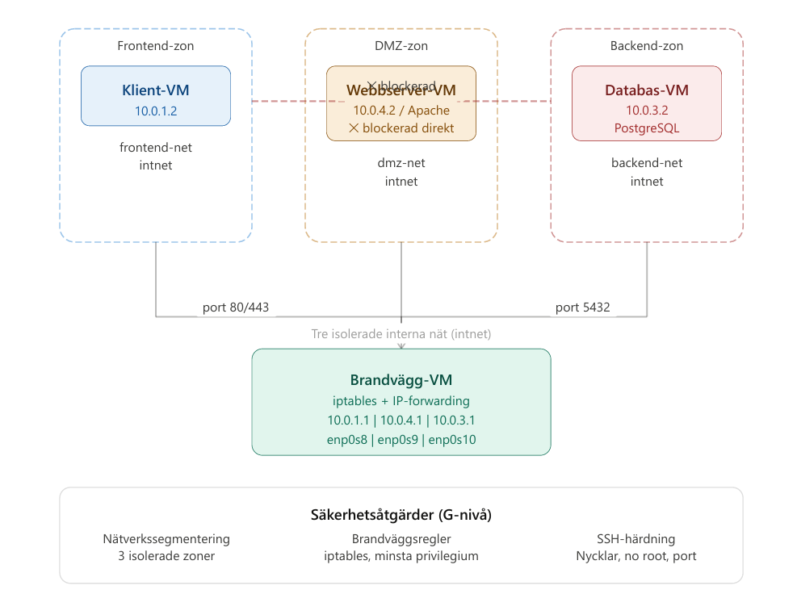

# Double-homed Firewall Projekt

Nätverkssegmentering med en dedikerad brandvägg som kontrollerar all trafik mellan tre isolerade zoner.

## Arkitektur




## Krav

- [VirtualBox](https://www.virtualbox.org/)
- [Vagrant](https://www.vagrantup.com/)
- Ansible (installeras på firewall-VM:en)

## Starta projektet

### 1. Starta alla VM:er
```bash
vagrant up
```

### 2. SSH in i brandväggen
```bash
vagrant ssh firewall
```

### 3. Installera Ansible (första gången)
```bash
echo "nameserver 8.8.8.8" | sudo tee /etc/resolv.conf
sudo apt update && sudo apt install -y ansible
```

### 4. Kopiera SSH-nycklar
```bash
mkdir -p ~/.ssh/vagrant_keys
cp /vagrant/.vagrant/machines/firewall/virtualbox/private_key ~/.ssh/vagrant_keys/firewall
cp /vagrant/.vagrant/machines/webserver/virtualbox/private_key ~/.ssh/vagrant_keys/webserver
cp /vagrant/.vagrant/machines/database/virtualbox/private_key ~/.ssh/vagrant_keys/database
chmod 600 ~/.ssh/vagrant_keys/*
```

### 5. Kör Ansible
```bash
cd /vagrant/ansible
ansible-playbook -i inventory.ini playbook.yml
```

## Verifiera att allt fungerar

SSH in i klient-VM:en:
```bash
vagrant ssh client
```

Testa att klient når webbservern:
```bash
curl http://10.0.4.2
# Förväntat svar: HTML-sida från Apache
```

Testa att klient INTE når databasen:
```bash
curl --connect-timeout 5 http://10.0.3.2
# Förväntat svar: Connection timeout (blockerad)
```

## Säkerhetsåtgärder

| Åtgärd | Beskrivning |
|--------|-------------|
| Nätverkssegmentering | 3 isolerade zoner via VirtualBox intnet |
| Brandväggsregler | iptables med minsta privilegium |
| SSH-härdning | Root-inloggning inaktiverad, endast nyckelbaserad autentisering, MaxAuthTries 3 |


