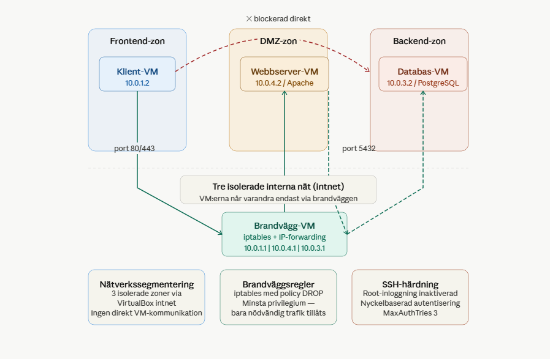

# 🔒 Double-homed Firewall Projekt

   

Nätverkssegmentering med en dedikerad brandvägg som kontrollerar all trafik mellan tre isolerade zoner. Hela miljön är automatiserad med Ansible och startas med ett enda kommando.

---

## 📐 Arkitektur



| Zon | VM | IP | Tjänst |
|-----|----|----|--------|
| Alla zoner | Brandvägg-VM | 10.0.1.1 \| 10.0.4.1 \| 10.0.3.1 | iptables + IP-forwarding |
| Frontend | Klient-VM | 10.0.1.2 | — |
| DMZ | Webbserver-VM | 10.0.4.2 | Apache |
| Backend | Databas-VM | 10.0.3.2 | PostgreSQL |

---

## ⚙️ Krav

- [VirtualBox](https://www.virtualbox.org/)
- [Vagrant](https://www.vagrantup.com/)
- Ansible *(installeras automatiskt via `setup_keys.sh`)*

---

## 🚀 Starta projektet

**Steg 1 — Starta alla VM:er**
```bash
vagrant up
```

**Steg 2 — SSH in i brandväggen**
```bash
vagrant ssh firewall
```

**Steg 3 — Kör setup och Ansible**
```bash
bash /vagrant/setup_keys.sh
cd /vagrant/ansible
ansible-playbook -i inventory.ini playbook.yml
```

## ✅ Idempotens verifierad

Ansible-playbooken är idempotent — att köra den flera gånger ger samma resultat utan oönskade ändringar. Firewall-rollen visar `changed=0` vid andra körningen vilket bekräftar att konfigurationen är stabil.

```
firewall : ok=10  changed=0  failed=0
```
---

## 🔁 Reproducerbar miljö — F3 verifierat

Miljön är helt reproducerbar med tre kommandon. `vagrant destroy && vagrant up` river och återskapar alla VM:er från grunden — Ansible konfigurerar sedan allt automatiskt till identiskt tillstånd varje gång.

**Så här verifierar du:**

```bash
# Steg 1 — Riv hela miljön
vagrant destroy -f

# Steg 2 — Bygg upp den igen från grunden
vagrant up

# Steg 3 — SSH in och kör Ansible
vagrant ssh firewall
bash /vagrant/setup_keys.sh
cd /vagrant/ansible
ansible-playbook -i inventory.ini playbook.yml

# Steg 4 — Verifiera att allt fungerar identiskt
bash /vagrant/verify.sh
```

Förväntat resultat: 9/9 PASS — samma resultat varje gång oavsett hur många gånger miljön rivs och byggs upp igen.

Miljön är inte bara reproducerbar i teorin — den är verifierbar i praktiken via verify.sh som bekräftar att alla trafikflöden och säkerhetsregler fungerar identiskt efter varje återuppbyggnad.

## ✅ Verifiera att allt fungerar

```bash
# Test 1 — Klient når webbservern (ska fungera)
vagrant ssh client
curl http://10.0.4.2
# Förväntat: HTML-sida från Apache

# Test 2 — Klient når INTE databasen (ska blockeras)
curl --connect-timeout 5 http://10.0.3.2
# Förväntat: Connection timeout

# Test 3 — Webbserver når databasen (ska fungera)
vagrant ssh webserver
nc -zv 10.0.3.2 5432
# Förväntat: Connection succeeded
```

---

## 🛡️ Säkerhetsåtgärder

Varje åtgärd är kopplad till ett konkret hot och verifierbar i miljön.

| Åtgärd | Vad den gör | Skyddar mot | Verifiering |
|--------|-------------|-------------|-------------|
| ✅ Nätverkssegmentering | Delar upp miljön i tre isolerade zoner via VirtualBox intnet. VM:er kan inte kommunicera direkt — all trafik tvingas via brandväggen. | Lateral movement — om webbservern komprometteras kan angriparen inte nå databasen direkt. | `curl --connect-timeout 5 10.0.3.2` från client → timeout |
| ✅ iptables DROP-policy | Blockerar all trafik som standard. Öppnar enbart port 80 och port 5432 med specifika source/destination IP. | Principle of least privilege — angripare kan inte skanna eller nå andra portar. | `sudo iptables -L FORWARD -n -v` visar specifika IP på varje ACCEPT-regel |
| ✅ SSH-härdning | Inaktiverar root-inloggning, kräver nyckelbaserad autentisering, sätter MaxAuthTries till 3. Konfigureras via Ansible på alla VM:er. | Brute force och credential stuffing — root-kontot är vanligaste målet vid automatiserade attacker. | `grep 'PermitRootLogin\|PasswordAuthentication\|MaxAuthTries' /etc/ssh/sshd_config` |
| ✅ FW-DROP loggning | Alla blockerade paket loggas med prefixet FW-DROP i kernel-loggen via iptables LOG-regel i Ansible-rollen. | Oupptäckta intrångsförsök — utan loggning syns inte portskanning eller attacker. | `sudo dmesg \| grep "FW-DROP"` visar blockerade försök i realtid |
---

## ⚠️ Kvarvarande säkerhetsbrister

Bristerna nedan är identifierade genom hotmodellering av miljön. De är kända, dokumenterade och prioriterade efter risk.

| Prio | Brist | Vad det innebär | Risk om oåtgärdat | Konkret åtgärd | Svårighet |
|------|-------|-----------------|-------------------|----------------|-----------|
| 🔴 1 | Okrypterad kommunikation webbserver ↔ databas | All SQL-trafik mellan 10.0.4.2 och 10.0.3.2 skickas i klartext på port 5432 | En angripare med tillgång till intnet-nätverket kan avlyssna databasinnehåll, inloggningsuppgifter och frågor (man-in-the-middle) | Aktivera TLS i PostgreSQL: sätt `ssl = on` i `postgresql.conf`, generera självsignerat certifikat och konfigurera `pg_hba.conf` att kräva `hostssl` | Medel — kräver certifikathantering |
| 🟡 2 | DNS hårdkodad till 8.8.8.8 | Alla VM:er använder Googles publika DNS direkt, utan filtrering eller intern kontroll | DNS-svar kan spoofas eller manipuleras. En komprometterad VM kan skickas till en angripares server via falska DNS-svar (DNS hijacking) | Sätt upp en intern DNS-resolver (t.ex. Unbound eller dnsmasq) på brandväggen som bara vidarebefordrar kända domäner. Blockera port 53 ut från alla VM:er utom brandväggen | Medel — ny Ansible-roll |
| 🟡 3 | Brandväggen är en Single Point of Failure (SPoF) | Hela nätverkssegmenteringen är beroende av en enda VM. Om brandväggen kraschar eller startas om försvinner all routning och isolering | Fullständigt avbrott för hela miljön. Ingen redundans — en krasch innebär att klient och databas är utan skydd tills brandväggen är uppe igen | Konfigurera ett aktivt/passivt brandväggspar med VRRP via `keepalived`. Den passiva tar över automatiskt om den aktiva inte svarar | Hög — kräver extra VM |
| 🟡 4 | Inga health checks eller automatiska larm | Det finns inget som övervakar att Apache, PostgreSQL och iptables faktiskt körs och svarar korrekt | En tjänst kan krascha och förbli nere utan att det upptäcks — vilket i en skarp miljö kan innebära datapåverkan eller säkerhetshål | Lägg till `systemd`-watchdog för varje tjänst. Alternativt ett enkelt övervakningsskript som körs som cronjob och skriver till en loggfil om en tjänst inte svarar | Låg–medel |
| 🟢 5 | Inga rate limits på HTTP-trafiken | Webbservern accepterar obegränsat antal förfrågningar från klienten utan begränsning | En angripare kan utföra en DoS-attack mot webbservern inifrån frontend-zonen — brandväggsreglerna skyddar inte mot volymsattacker på tillåtna portar | Konfigurera `iptables -m limit` för att begränsa antal nya anslutningar per sekund från samma IP, eller använd Apache-modulen `mod_evasive` | Låg |
| 🟢 6 | Vagrant SSH-nycklar är generiska | `setup_keys.sh` kopierar SSH-nycklar utan rotation eller unik identitet per miljö | Vid läckage av en nyckel kan en angripare nå alla VM:er. Nycklarna roteras inte automatiskt efter `vagrant reload` | Generera unika nycklar per VM vid varje `vagrant up` via en Ansible-task istället för att kopiera en delad nyckel | Medel |

## 🤔 Varför VirtualBox och inte containers?

> VirtualBox (hypervisor typ 2) valdes framför containers eftersom projektet kräver fullständig nätverksisolering mellan zoner. Containers delar kärna och är svårare att isolera på nätverksnivå. VirtualBox ger varje VM ett eget nätverksgränssnitt vilket möjliggör realistisk brandväggskonfiguration med iptables.

---

## 💡 Fördelar med virtualisering — kopplat till designbeslut

Virtualiseringsfördelarna är inte bara teoretiska — varje fördel är direkt kopplad till ett konkret beslut i projektet.

| Fördel | Hur det används i projektet | Konkret designbeslut |
|--------|----------------------------|----------------------|
| 🔒 Isolerade miljöer | Varje VM har ett eget nätverksgränssnitt — ett fel eller intrång i webbservern påverkar inte databasen | Tre separata VirtualBox intnet-nätverk istället för ett gemensamt |
| ♻️ Identisk miljö | `vagrant destroy && vagrant up` startar exakt samma miljö varje gång — inga manuella steg | Vagrantfile definierar alla 4 VM:er med fasta IP-adresser och nätverkskopplingar |
| 🧪 Säker testmiljö | Brandväggsregler kan testas och verifieras utan risk för produktionspåverkan | verify.sh körs mot miljön efter varje `ansible-playbook` för att bekräfta att reglerna fungerar |
| 💰 Kostnadseffektivt | Fyra isolerade servrar med dedikerade roller körs på en fysisk maskin | En server per roll (brandvägg, webbserver, databas, klient) utan hårdvarukostnad |
| 🔁 Repeterbarhet | Ansible-playbooken är idempotent — `changed=0` på firewall-rollen vid andra körningen | `changed_when: false` på command-tasks säkerställer korrekt idempotensrapportering |
## 🔄 Skalbarhet och redundans

Varje tjänst körs på en dedikerad VM — en server per roll. Om webbservern är nere påverkas inte databasen. En naturlig nästa steg vore att lägga till en andra webbserver för redundans.

---

## 📊 Trafikanalys — verifierad segmentering

Segmenteringen är inte bara konfigurerad — den är verifierbar i realtid via iptables paketräknare. Kolumnerna `pkts` och `bytes` i `sudo iptables -L FORWARD -n -v` visar att trafik faktiskt matchat rätt regler.

| Regel | Source → Destination | Port | Verifierad trafik |
|-------|---------------------|------|-------------------|
| Klient → webbserver | 10.0.1.2 → 10.0.4.2 | 80 | Paket matchar ACCEPT-regeln efter `curl http://10.0.4.2` |
| Webbserver → databas | 10.0.4.2 → 10.0.3.2 | 5432 | Paket matchar ACCEPT-regeln efter `nc -zv 10.0.3.2 5432` |
| Klient → databas direkt | 10.0.1.2 → 10.0.3.2 | 80 | Paket loggas med FW-DROP och droppas — ingen ACCEPT-regel matchar |

Detta visar att segmenteringen fungerar på paketnikå — inte bara att tjänsterna svarar, utan att rätt regler träffas av rätt trafik.

Verifiera själv:
```bash
vagrant ssh firewall
sudo iptables -L FORWARD -n -v
```

## 🐍 Python-anslutningstest — applikationsnivå

Webbservern kan nå databasen inte bara på nätverksnivå (port 5432 öppen) utan även på applikationsnivå via en faktisk PostgreSQL-anslutning med Python.

Kör testet från firewall-terminalen:

```bash
ssh -o StrictHostKeyChecking=no -i ~/.ssh/vagrant_keys/webserver vagrant@10.0.4.2 "python3 /vagrant/db_test.py"
```

Förväntat resultat: 
```
PASS  Anslutning lyckades!
PostgreSQL-version: PostgreSQL 14.22
Databas: appdb · Användare: webuser
PASS  Webbservern kan nå databasen på applikationsnivå
```

Detta bevisar att brandväggsreglerna tillåter exakt rätt trafik — webbservern når databasen på applikationsnivå medan klienten är blockerad.


## 🔍 Hotmodellering (STRIDE-inspirerad)

| Hot | Kategori | Sannolikhet | Konsekvens | Implementerad motåtgärd |
|-----|----------|-------------|------------|-------------------------|
| Angripare brute-forcar SSH | Spoofing | Hög | Hög | MaxAuthTries 3, nyckelautentisering, root-inloggning inaktiverad |
| Komprometterad webbserver når databasen | Elevation of Privilege | Medel | Kritisk | Segmentering + DROP-policy, webb→databas endast port 5432 |
| Portskanning av interna nät | Information Disclosure | Hög | Medel | DROP-policy ger inget svar — portar avslöjas inte |
| Avlyssning av databasanslutning | Information Disclosure | Låg | Hög | Ej åtgärdat — identifierat som brist nr 2 |
| Tjänstkrasch går oupptäckt | Denial of Service | Medel | Medel | Ej åtgärdat — identifierat som brist nr 5 |

---

## 🚀 Köra verifieringsskriptet

Automatiserat skript som verifierar alla trafikflöden utan manuella steg. Kör inifrån firewall-VM:en:

```bash
vagrant ssh firewall
bash /vagrant/verify.sh
```

Förväntat resultat:

```
9/9 PASS — alla tester godkända
```


## 📁 Mappstruktur och rollstruktur

Projektet är uppdelat i Ansible-roller där varje roll har ett tydligt och avgränsat ansvar. Detta är ett medvetet designbeslut — en roll per tjänst gör konfigurationen lättare att felsöka, återanvända och bygga vidare på.

| Roll | Ansvar | Varför separat? |
|------|--------|-----------------|
| `firewall` | iptables-regler, IP-forwarding, loggning | Brandväggslogiken är oberoende av tjänsterna — kan bytas ut utan att påverka webserver eller databas |
| `webserver` | Apache-installation, testsida, routing | Isolerad så att webblagret kan skalas eller bytas mot nginx utan att röra övriga roller |
| `database` | PostgreSQL-installation, lyssnar på rätt IP | Databaskonfiguration hålls separat för att enkelt kunna byta till annan databasmotor |
| `ssh_hardening` | Root-inloggning, nyckelautentisering, MaxAuthTries | Körs på alla VM:er — en gemensam härdningsroll istället för att upprepa konfiguration i varje roll |
| `client` | Routing till webserver-nätet | Minimal roll som bara konfigurerar klientens nätverksvägar |

Rollstrukturen följer **principle of least privilege** även på konfigurationsnivå — varje roll gör exakt det den behöver och inget mer.

```
double-homed-firewall-project/
├── Vagrantfile               # Definierar alla 4 VM:er och nätverk
├── setup_keys.sh             # Distribuerar SSH-nycklar
├── verify.sh                 # Automatiserat verifieringsskript
├── README.md
├── Diagram_1.png             # Nätverksdiagram
└── ansible/
    ├── inventory.ini         # Hosts och IP-adresser
    ├── playbook.yml          # Kopplar roles till VM:er
    └── roles/
        ├── firewall/         # iptables-regler och IP-forwarding
        ├── webserver/        # Apache-installation
        ├── database/         # PostgreSQL-installation
        ├── client/           # Klientkonfiguration
        └── ssh_hardening/    # SSH-härdning på alla VM:er
```
---

*YH Enköping · Virtualiseringsteknik & Automation · Iman Noureddin & Najma Omar Osman*
