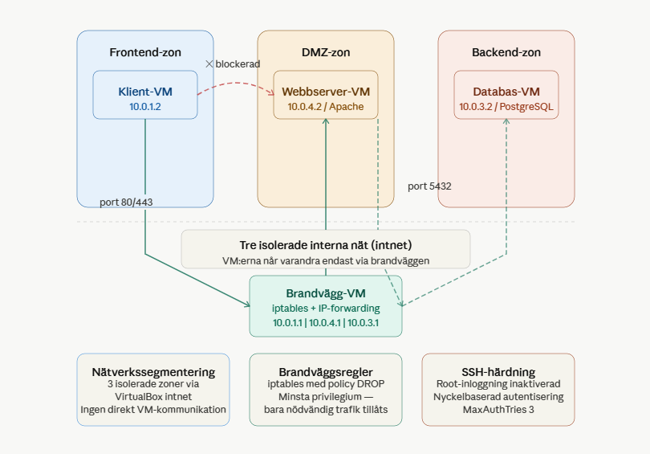

# 🔒 Double-homed Firewall Projekt


Nätverkssegmentering med en dedikerad brandvägg som kontrollerar all trafik mellan tre isolerade zoner. Hela miljön är automatiserad med Ansible och startas med ett enda kommando.

---

## 📐 Arkitektur



| Zon | VM | IP | Nätverk |
|-----|----|----|---------|
| Frontend | Klient-VM | 10.0.1.2 | frontend-net (intnet) |
| DMZ | Webbserver-VM | 10.0.4.2 | dmz-net (intnet) |
| Backend | Databas-VM | 10.0.3.2 | backend-net (intnet) |
| — | Brandvägg-VM | 10.0.1.1 \| 10.0.4.1 \| 10.0.3.1 | alla zoner |

---

## ⚙️ Krav

- [VirtualBox](https://www.virtualbox.org/)
- [Vagrant](https://www.vagrantup.com/)
- Ansible *(installeras automatiskt via `setup_keys.sh`)*

---

## 🚀 Starta projektet

**1. Starta alla VM:er**
```bash
vagrant up
```

**2. SSH in i brandväggen**
```bash
vagrant ssh firewall
```

**3. Kör setup och Ansible**
```bash
bash /vagrant/setup_keys.sh
cd /vagrant/ansible
ansible-playbook -i inventory.ini playbook.yml
```

---

## ✅ Verifiera att allt fungerar

```bash
# SSH in i klient-VM:en
vagrant ssh client

# Test 1 — Klient når webbservern (ska fungera)
curl http://10.0.4.2
# Förväntat: HTML-sida från Apache

# Test 2 — Klient når INTE databasen (ska blockeras)
curl --connect-timeout 5 http://10.0.3.2
# Förväntat: Connection timeout

# Test 3 — Webbserver når databasen
vagrant ssh webserver
nc -zv 10.0.3.2 5432
# Förväntat: Connection succeeded
```

---

## 🛡️ Säkerhetsåtgärder

| Åtgärd | Beskrivning |
|--------|-------------|
| Nätverkssegmentering | 3 isolerade zoner via VirtualBox intnet |
| Brandväggsregler | iptables med minsta privilegium — policy DROP som standard |
| SSH-härdning | Root-inloggning inaktiverad, nyckelbaserad autentisering, MaxAuthTries 3 |

---

## 🤔 Varför VirtualBox och inte containers?

> VirtualBox (hypervisor typ 2) valdes framför containers eftersom projektet kräver fullständig nätverksisolering mellan zoner. Containers delar kärna och är svårare att isolera på nätverksnivå. VirtualBox ger varje VM ett eget nätverksgränssnitt vilket möjliggör realistisk brandväggskonfiguration med iptables.

---

## 💡 Fördelar med virtualisering

- Isolerade miljöer — ett fel i en VM påverkar inte de andra
- Reproducerbar miljö — `vagrant up` ger identisk miljö varje gång
- Säker testmiljö — brandväggsregler kan testas utan risk för produktionsmiljön
- Kostnadseffektivt — flera isolerade servrar på en fysisk maskin

---

## ⚠️ Kvarvarande säkerhetsbrister

| Brist | Risk | Åtgärd |
|-------|------|--------|
| Ingen loggning av brandväggsträffar | Attacker syns inte | Aktivera iptables LOG-regler |
| DNS ej härdad (8.8.8.8 hårdkodad) | DNS-spoofing möjlig | Intern DNS-server |
| Ingen kryptering webbserver↔databas | Avlyssning möjlig | TLS på PostgreSQL |

---

## 📁 Mappstruktur

```
double-homed-firewall-project/
├── Vagrantfile               # Definierar alla 4 VM:er och nätverk
├── setup_keys.sh             # Distribuerar SSH-nycklar
├── README.md
├── diagram.png               # Nätverksdiagram
└── ansible/
    ├── inventory.ini         # Hosts och IP-adresser
    ├── playbook.yml          # Huvudfil — kopplar roles till VM:er
    └── roles/
        ├── firewall/         # iptables-regler och IP-forwarding
        ├── webserver/        # Apache-installation
        ├── database/         # PostgreSQL-installation
        ├── client/           # Klientkonfiguration
        └── ssh_hardening/    # SSH-härdning på alla VM:er
```

---

*YH Enköping · Virtualiseringsteknik & Automation · Iman Noureddin & Najma Omar Osman*
